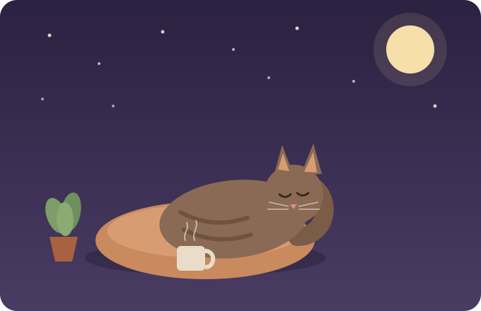

<h1 align="center">hey, I'm Sun ☕</h1> <p align="center"> <em>learning to code, one cup of tea at a time</em> </p> <p align="center">  </p>

## Progress

| Project | Status | Language |
|---|---|---|
| [Libft] | ✅ Passed | C |
| [get_next_line] | ✅ Passed | C |
| [ft_printf] | ✅ Passed | C |
| [push_swap] | 🚧 In progress | C |
| [Python Module] | 🚧 In progress | Python |


```
⠀⢰⣤⡀⠀⠀⠀⠀⠀⠀⠀⠀⠀⠀⠀⠀⠀⠀⠀⠀⠀⠀⠀⠀⠀⠀⠀⠀⠀
⠀⠀⠈⣿⣿⣦
⠀⠀⠀⣀⡘⣿⣿⣷⡰⣶⠀⠀⠀⠀⠀⠀⠀⠀⠀⠀⠀⠀⢀⣠⣤⣶⠟⠁
⠀⠀⢻⣿⣿⣌⢿⣿⣷⣭⣤⣤⣤⣤⣄⣀⠀⠀⠀⣠⣶⣿⣿⡿⠃
⠀⠀⢸⣿⣿⣿⢎⣿⣿⣿⣿⣿⣿⣿⣿⣿⣷⣶⣿⣿⣿⠟⠉
⠀⠀⣸⠛⠉⢀⣿⣿⠋⣭⢿⣿⣿⣿⡿⠻⣿⣿⡿⠋
⢰⣿⣿⣶⡆⠻⠿⣿⣦⣤⣾⡿⣿⣧⠛⢀⣿⣿⡇
⠀⠻⣿⣿⣿⠀⢀⣿⣿⣿⠟⠛⢿⣿⣿⣿⣿⣿⡇⣠⣤⣤⣤
⠀⠀⠈⠻⣿⣦⡻⣿⣿⣿⡇⠀⣰⣿⣿⣿⡏⠀⢀⣿⣿⣿⠟
⠀⠀⠀⠀⣿⣿⣿⣮⣛⠿⠷⣾⣿⣿⡿⠿⣣⣴⡿⠟⠋⠀
⠀⠀⠀⠀⣿⣿⣿⣿⣿⣿⣷⣶⣶⣶⣶⣿⣿⡟
⠀⠀⠀⢼⡿⠙⠿⣿⣿⣿⣿⣿⣿⣿⣿⡿⠏
⠀⠀⠀⠀⠀⠀⠀⠀⠉⠙⠛⠛⠛⠋⠉⠺⠷
```
